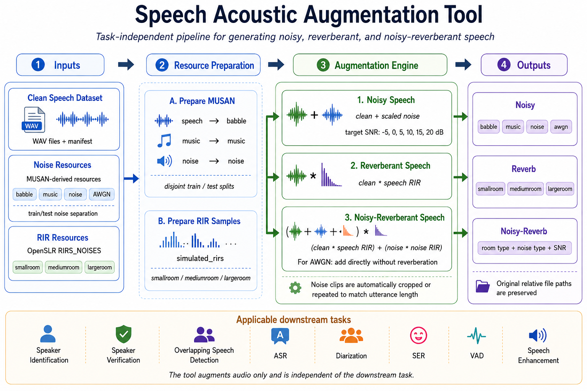

# SpeechAug: Task-Independent Acoustic Augmentation for Speech Processing

SpeechAug is a task-independent acoustic augmentation toolkit for generating controlled **noisy**, **reverberant**, and **noisy-reverberant** speech conditions for speech processing applications.


<p align="center">
  
</p>
This repository provides the **SpeechAug** augmentation framework for evaluating speech-processing systems under realistic acoustic recording conditions. The tool modifies only the acoustic signal and is independent of the downstream task.

It can be used for:

- Speaker identification
- Speaker verification
- Overlapping speech detection
- Automatic speech recognition
- Speaker diarization
- Speech emotion recognition
- Voice activity detection
- Speech enhancement and robustness evaluation

The repository also includes scripts for preparing external acoustic resources such as MUSAN and OpenSLR RIRS_NOISES, as well as small example subsets that can be used for lightweight testing.

---

## Overview

**Project name:** SpeechAug  
**Repository name:** `speechaug`

The tool generates controlled acoustic variants from clean speech recordings. Given a clean speech dataset and a manifest file, it can produce:

1. **Noisy speech**
2. **Reverberant speech**
3. **Noisy-reverberant speech**

The framework is designed to be reusable across different speech tasks. It does not assume any task-specific label format. It only requires:

- A root directory containing clean `.wav` files
- A manifest file containing relative paths to those `.wav` files
- Optional noise and RIR resources

---

## Repository Structure

```text
speechaug/
├── assets/
├── configs/
│   ├── default.yaml
│   ├── noisy_only.yaml
│   ├── reverb_only.yaml
│   └── noisy_reverb.yaml
├── docs/
│   ├── augmentation_protocol.md
│   └── external_resources.md
├── examples/
│   ├── Grid_OSD/
│   │   └── wav/
│   ├── voxceleb/
│   ├── grid_osd_manifest.txt
│   └── voxceleb_manifest.txt
├── external_resources/
│   ├── musan_sample/
│   └── rirs_sample/
├── scripts/
│   ├── download_external_resources.sh
│   ├── prepare_musan_split.py
│   ├── prepare_musan_split_limited.py
│   └── prepare_rirs_sample.py
├── .gitignore
├── LICENSE
├── README.md
├── requirements.txt
└── speech_augmenter.py
```

---

## Supported Augmentations

### 1. Noisy Speech

Clean speech is mixed with additive noise at a target signal-to-noise ratio (SNR).

```text
noisy_speech = clean_speech + scaled_noise
```

Supported noise types:

```text
babble
music
noise
awgn
```

The non-AWGN noise types are loaded from a noise corpus such as MUSAN. AWGN is generated synthetically.

---

### 2. Reverberant Speech

Clean speech is convolved with a room impulse response (RIR).

```text
reverberant_speech = clean_speech * speech_RIR
```

The default room conditions are:

```text
smallroom
mediumroom
largeroom
```

These room names are compatible with the common structure of OpenSLR RIRS_NOISES.

---

### 3. Noisy-Reverberant Speech

For noisy-reverberant speech, the speech and environmental noise are reverberated separately.

```text
speech_reverb = clean_speech * speech_RIR
noise_reverb  = noise * noise_RIR
mixture       = speech_reverb + scaled_noise_reverb
```

The speech RIR and noise RIR are selected from the same room condition, but they may be different RIR files.

For AWGN, the behavior is different:

```text
mixture = speech_reverb + scaled_awgn
```

AWGN is synthetic channel/sensor noise and is added directly without reverberation.

---

## Default SNR Levels

The default SNR levels are:

```text
-5, 0, 5, 10, 15, 20 dB
```

You can modify them in the configuration files, for example:

```yaml
snr_levels: [-5, 0, 5, 10, 15, 20]
```

Noise is scaled using the power of the reference speech signal. For noisy-reverberant speech, the SNR is computed relative to the reverberated speech signal.


---

## Installation

Create and activate a Python environment:

```bash
conda create -n augm python=3.10 -y
conda activate augm
```

Install dependencies:

```bash
pip install -r requirements.txt
```

Typical dependencies include:

```text
numpy
scipy
librosa
soundfile
pyyaml
tqdm
joblib
```

---

## Downloading Full External Resources

For full experiments, download MUSAN and RIRS_NOISES:

```bash
bash scripts/download_external_resources.sh
```

This should create:

```text
external_resources/
├── musan/
└── RIRS_NOISES/
```

The full datasets should remain local and should not be committed to GitHub.

---

## Preparing MUSAN for Full Experiments

The augmentation tool expects non-AWGN noise resources in the following structure:

```text
external_resources/musan_split/
├── babble/
│   ├── train/
│   └── test/
├── music/
│   ├── train/
│   └── test/
└── noise/
    ├── train/
    └── test/
```

Prepare the full MUSAN split using:

```bash
python scripts/prepare_musan_split.py \
  --musan-root external_resources/musan \
  --output-root external_resources/musan_split \
  --test-ratio 0.2 \
  --sample-rate 16000 \
  --babble-duration 10.0 \
  --num-babble-train 2000 \
  --num-babble-test 500 \
  --min-babble-speakers 3 \
  --max-babble-speakers 7 \
  --seed 2025 \
  --symlink \
  --overwrite
```

### MUSAN Mapping

The preparation script uses the following mapping:

```text
MUSAN speech -> babble
MUSAN music  -> music
MUSAN noise  -> noise
```

### Train/Test Noise Separation

The preparation script ensures that train and test noise sources are disjoint:

```text
music/train and music/test use different source clips
noise/train and noise/test use different source clips
babble/train and babble/test are generated from different speech source pools
```

This is useful for evaluating model generalization under unseen noise conditions.

---

## How Babble Is Generated

Babble is generated from the speech portion of MUSAN.

For each babble file, the script randomly selects multiple speech clips and mixes them together:

```text
babble = speech_1 + speech_2 + ... + speech_K
```

The default number of mixed speakers is between 3 and 7:

```bash
--min-babble-speakers 3
--max-babble-speakers 7
```

The default babble duration for full preparation is 10 seconds:

```bash
--babble-duration 10.0
```

Babble files are newly generated `.wav` files. Music and noise files are copied or symlinked from the original MUSAN files.

---

## Preparing Small MUSAN Samples for GitHub Examples

For a lightweight GitHub example, you may create a small MUSAN-derived subset:

```text
external_resources/musan_sample/
├── babble/
│   ├── train/
│   └── test/
├── music/
│   ├── train/
│   └── test/
└── noise/
    ├── train/
    └── test/
```


This creates a small resource folder that can be used for demonstration and testing.

---

## Preparing Small RIRS Samples for GitHub Examples

For lightweight GitHub examples, prepare a small RIRS_NOISES subset:

```text
external_resources/rirs_sample/
    ├── smallroom/
    ├── mediumroom/
    └── largeroom/
```

This preserves the folder structure expected by the augmenter:

```text
rir_root / simulated_rirs / room_type / ** / *.wav
```

For example:

```text
external_resources/rirs_sample/smallroom/
external_resources/rirs_sample/mediumroom/
external_resources/rirs_sample/largeroom/
```


---

## Expected Noise Structure

The augmenter expects non-AWGN noise files in this structure:

```text
noise_root/
├── babble/
│   ├── train/
│   │   └── *.wav
│   └── test/
│       └── *.wav
├── music/
│   ├── train/
│   │   └── *.wav
│   └── test/
│       └── *.wav
└── noise/
    ├── train/
    │   └── *.wav
    └── test/
        └── *.wav
```

Example:

```bash
--noise-root external_resources/musan_sample
```

or:

```bash
--noise-root external_resources/musan_split
```

---

## Expected RIR Structure

The augmenter expects RIR files in this structure:

```text
rir_root/
└── simulated_rirs/
    ├── smallroom/
    │   └── **/*.wav
    ├── mediumroom/
    │   └── **/*.wav
    └── largeroom/
        └── **/*.wav
```

---

## Handling Variable-Length Noise Clips

MUSAN noise and music clips may have different durations. Some files may last only a few seconds, while others may last several minutes.

The augmentation tool handles this automatically:

- If the selected noise is longer than the clean utterance, a random segment is cropped.
- If the selected noise is shorter than the clean utterance, it is repeated and then cropped.
- If the selected noise has the same duration as the clean utterance, it is used directly.

This ensures that the noise signal always matches the clean speech duration before SNR scaling.

Babble files generated by the preparation script have fixed duration, controlled by:

```bash
--babble-duration
```

---

## Manifest Format

The manifest contains relative paths to clean `.wav` files.


```text
train speaker001/utt001.wav
valid speaker001/utt002.wav
test speaker002/utt001.wav
```

The clean file is expected at:

```text
clean_root / relative_path
```

For example, if:

```text
clean_root = examples/Grid_OSD/wav
relative_path = s1/example.wav
```

then the clean file is expected at:

```text
examples/Grid_OSD/wav/s1/example.wav
```

---

## Dataset Split and Noise Split Mapping

The augmentation tool maps dataset splits to noise splits as follows:

```text
train -> train noise
valid -> train noise
dev   -> train noise
val   -> train noise
test  -> test noise
eval  -> test noise
all   -> train noise
```

This allows train/validation augmentation to use one set of noise clips and test/evaluation augmentation to use unseen noise clips.

---

## Example Manifests

This repository includes two small example datasets to demonstrate that the augmentation tool is task-independent. These examples are only for testing the augmentation pipeline and showing how to organize input speech files and manifests.

### GRID OSD Example

The `Grid_OSD` example is intended for a **frame-level overlapping speech detection** use case. It illustrates how clean speech files used in an OSD-style experiment can be passed through the same acoustic augmentation pipeline.

```text
examples/grid_osd_manifest.txt
```

Example lines:

```text
train s1/bbaf2n.wav
train s1/bbaf3s.wav
train s2/bbaf4p.wav
```

Use with:

```bash
--clean-root examples/Grid_OSD/wav
--manifest examples/grid_osd_manifest.txt
```

The augmentation tool only modifies the audio waveform. It does not modify frame-level OSD labels or annotations. Because the default configuration keeps the output duration equal to the input duration, time-aligned labels can remain compatible when the augmentation does not change the temporal structure of the utterance.

### VoxCeleb Example

The `voxceleb` example is intended for a **speaker identification** use case. It illustrates how speaker-organized speech files can be augmented while preserving the original relative file paths.

```text
examples/voxceleb_manifest.txt
```

Use with either:

```bash
--clean-root examples/voxceleb/wav
```

or, if your example files are directly under `examples/voxceleb/`:

```bash
--clean-root examples/voxceleb
```

For speaker identification, the augmentation changes the acoustic condition of the utterance but does not change the speaker identity. Therefore, speaker labels are expected to remain the same.

---

## Running the Augmentation Tool

### Full Default Augmentation

This generates noisy, reverberant, and noisy-reverberant outputs.

```bash
python speech_augmenter.py \
  --config configs/default.yaml \
  --clean-root examples/Grid_OSD/wav \
  --manifest examples/grid_osd_manifest.txt \
  --output-root examples/output_grid_osd_default \
  --noise-root external_resources/musan_sample \
  --rir-root external_resources/rirs_sample
```

---

### Noisy-Only Augmentation

```bash
python speech_augmenter.py \
  --config configs/noisy_only.yaml \
  --clean-root examples/Grid_OSD/wav \
  --manifest examples/grid_osd_manifest.txt \
  --output-root examples/output_grid_osd_noisy \
  --noise-root external_resources/musan_sample \
  --rir-root external_resources/rirs_sample
```

---

### Reverberant-Only Augmentation

```bash
python speech_augmenter.py \
  --config configs/reverb_only.yaml \
  --clean-root examples/Grid_OSD/wav \
  --manifest examples/grid_osd_manifest.txt \
  --output-root examples/output_grid_osd_reverb \
  --noise-root external_resources/musan_sample \
  --rir-root external_resources/rirs_sample
```

Note: `--noise-root` may still be required by the command-line interface even when using reverb-only augmentation.

---

### Noisy-Reverberant Augmentation

```bash
python speech_augmenter.py \
  --config configs/noisy_reverb.yaml \
  --clean-root examples/Grid_OSD/wav \
  --manifest examples/grid_osd_manifest.txt \
  --output-root examples/output_grid_osd_noisy_reverb \
  --noise-root external_resources/musan_sample \
  --rir-root external_resources/rirs_sample
```

---

## Configuration Files

The augmentation protocol is controlled by YAML files in `configs/`.

Example:

```yaml
sample_rate: 16000
seed: 2025

snr_levels: [-5, 0, 5, 10, 15, 20]

noise_types:
  - babble
  - music
  - noise
  - awgn

room_types:
  - smallroom
  - mediumroom
  - largeroom

rir_family: simulated_rirs

conditions:
  noisy: true
  reverb: true
  noisy_reverb: true

keep_length: true
normalize_rir_peak: false
normalize_reverb_rms: false
direct_threshold_fraction: 0.2
preroll_ms: 1.0
```

---

## Output Structure

The output directory follows the augmentation condition.

```text
output_root/
├── noisy/
│   ├── babble/
│   │   ├── -5dB/
│   │   ├── 0dB/
│   │   └── ...
│   ├── music/
│   ├── noise/
│   └── awgn/
├── reverb/
│   ├── smallroom/
│   ├── mediumroom/
│   └── largeroom/
└── noisy_reverb/
    ├── smallroom/
    │   ├── babble/
    │   ├── music/
    │   ├── noise/
    │   └── awgn/
    ├── mediumroom/
    └── largeroom/
```

The original relative path from the manifest is preserved under each condition.

Example:

```text
examples/output_grid_osd_default/noisy/babble/0dB/s1/bbaf2n.wav
examples/output_grid_osd_default/reverb/smallroom/s1/bbaf2n.wav
examples/output_grid_osd_default/noisy_reverb/smallroom/music/10dB/s1/bbaf2n.wav
```

---

## Checking Generated Files

Count generated files:

```bash
find examples/output_grid_osd_default -type f -name "*.wav" | wc -l
```

Preview generated files:

```bash
find examples/output_grid_osd_default -type f -name "*.wav" | sort | head
```

Check example resource folders:

```bash
find external_resources/musan_sample -maxdepth 3 -type d | sort
find external_resources/rirs_sample -maxdepth 4 -type d | sort
```

---

## Reproducibility

The tool uses deterministic random seeds. For each utterance and augmentation condition, the selected noise/RIR and random crop are generated from a stable seed derived from:

```text
condition
split
relative path
noise type
SNR
room type
global seed
```

This makes the augmentation process reproducible across runs when the same inputs and configuration are used.

---

## Notes for Downstream Tasks

This tool modifies only the audio signal. It does not modify task labels or annotations.

For tasks such as speaker identification or speaker verification, labels usually remain unchanged.

For tasks such as overlapping speech detection, speech recognition, diarization, or voice activity detection, users should ensure that the labels remain valid for their experimental setup.

The default setting keeps the output duration equal to the input clean utterance duration:

```yaml
keep_length: true
```

This helps preserve alignment for tasks that depend on time annotations.

---

## Data and License Notes

This repository should not include full external datasets.

Recommended:

- Keep full MUSAN locally under `external_resources/musan/`
- Keep full prepared MUSAN under `external_resources/musan_split/`
- Keep full RIRS_NOISES locally under `external_resources/RIRS_NOISES/`
- Commit only small example resources if their licenses allow redistribution
- Keep attribution files for any included external-resource samples

Users are responsible for checking and respecting the licenses of any external datasets they download or redistribute.

---

## Related Papers

This repository is related to acoustic robustness experiments used in the following works:

- Y. Terraf and Y. Iraqi, “CAT-Net: A Channel and Self-Attention TCN for Robust Frame-Level Overlapping Speech Detection,” *IEEE Transactions on Audio, Speech and Language Processing*, vol. 34, pp. 1184–1199, 2026.
- Y. Terraf and Y. Iraqi, “TARNet: A Temporal-Aware Multi-Scale Architecture for Closed-Set Speaker Identification,” *arXiv preprint arXiv:2605.07735*, 2026.
- Y. Terraf and Y. Iraqi, “Robust Feature Extraction Using Temporal Context Averaging for Speaker Identification in Diverse Acoustic Environments,” *IEEE Access*, vol. 12, pp. 14094–14115, 2024.
- Y. Terraf and Y. Iraqi, “CoMISI: Multimodal Speaker Identification in Diverse Audio-Visual Conditions Through Cross-Modal Interaction,” in *Neural Information Processing*, Springer Nature Singapore, pp. 61–77, 2026.

---

## Citation

If you use this repository or the acoustic augmentation protocol in your research, please cite the related papers:

```bibtex
@article{terraf2026catnet,
  author  = {Terraf, Yassin and Iraqi, Youssef},
  title   = {CAT-Net: A Channel and Self-Attention TCN for Robust Frame-Level Overlapping Speech Detection},
  journal = {IEEE Transactions on Audio, Speech and Language Processing},
  year    = {2026},
  volume  = {34},
  pages   = {1184--1199},
  doi     = {10.1109/TASLPRO.2026.3661413}
}

@article{terraf2026tarnet,
  author  = {Terraf, Yassin and Iraqi, Youssef},
  title   = {TARNet: A Temporal-Aware Multi-Scale Architecture for Closed-Set Speaker Identification},
  journal = {arXiv preprint arXiv:2605.07735},
  year    = {2026}
}

@article{terraf2024temporalcontext,
  author  = {Terraf, Yassin and Iraqi, Youssef},
  title   = {Robust Feature Extraction Using Temporal Context Averaging for Speaker Identification in Diverse Acoustic Environments},
  journal = {IEEE Access},
  year    = {2024},
  volume  = {12},
  pages   = {14094--14115},
  doi     = {10.1109/ACCESS.2024.3356730}
}

@inproceedings{terraf2026comisi,
  author    = {Terraf, Yassin and Iraqi, Youssef},
  title     = {CoMISI: Multimodal Speaker Identification in Diverse Audio-Visual Conditions Through Cross-Modal Interaction},
  booktitle = {Neural Information Processing},
  year      = {2026},
  publisher = {Springer Nature Singapore},
  pages     = {61--77},
  isbn      = {978-981-96-6594-5}
}
```

If you use MUSAN-derived examples or full MUSAN data, cite the MUSAN corpus. If you use OpenSLR RIRS_NOISES-derived examples or full RIRS data, cite and acknowledge the OpenSLR RIRS_NOISES resource according to its license and documentation.

---

## Status

SpeechAug is intended as a reusable, task-independent acoustic augmentation toolkit for speech research. It was designed to support controlled robustness evaluation under additive noise, reverberation, and combined noisy-reverberant acoustic conditions.
